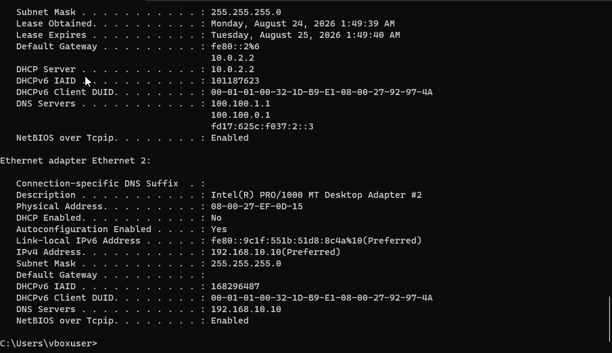

# DC01 Network Configuration

## Objective

Create a separate internal LAB network for communication between DC01 and client machines while retaining NAT connectivity for external network access.

## Network Interfaces

### Adapter 1 - NAT
Purpose: Provide DC01 with external network/Internal access

### Adapter 2 - Internal Network
Network name: LAB
Purpose: Communicate with the internal PCs

## Static IPv4 Configuration

- **IP address:** 192.168.10.10
- **Subnet mask:** 255.255.255.0 (/24)
- **Default gateway:** None
- **Preferred DNS:** 192.168.10.10

DC01 will later host the DNS service required by the Active Directory environment.

## Why Static IP?

DC01 uses a static IP address so that its address remains predictable and does not change over time. This allows client machines and network services to reliably locate the server.

## Verification

`ipconfig /all`

