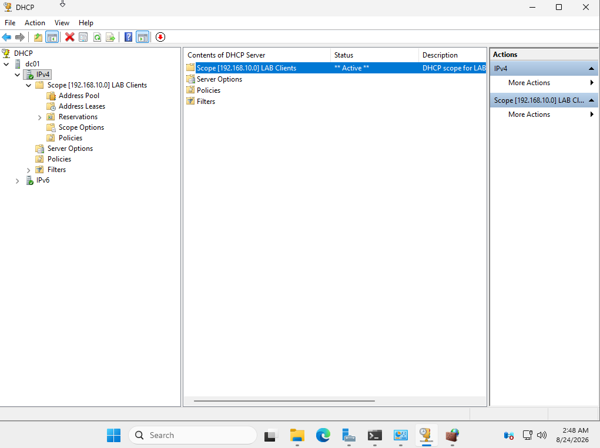
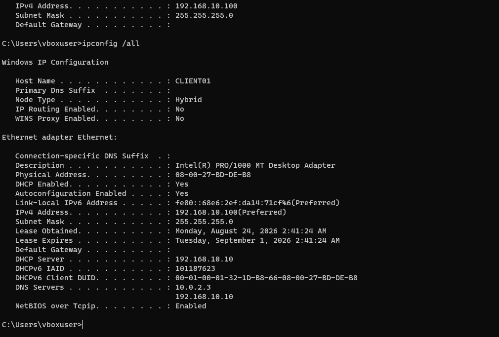
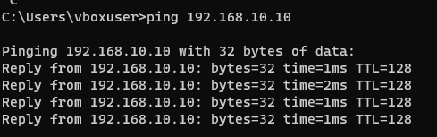

# DHCP Configuration

## Objective

Configure a DHCP server on DC01 to automatically assign IPv4 addresses to client machines connected to the LAB network.

This avoids having to manually configure the network settings of every client machine.

## DHCP Scope

A DHCP scope named `LAB Clients` was created for the `192.168.10.0/24` network.

- Start IP: 192.168.10.100
- End IP: 192.168.10.200
- Subnet mask: 255.255.255.0 (/24)

The lower part of the subnet was left outside the DHCP pool so that addresses can be used for infrastructure devices with static IP configurations. DC01, for example, uses the static address `192.168.10.10`.

## Lease Duration

The lease duration was left at the default value of 8 days.

A DHCP address is leased to a client rather than permanently assigned. If the client remains connected, it can renew the lease. If the device leaves the network and the lease eventually expires, the address can be returned to the DHCP pool and assigned to another client.

## DHCP Options

DHCP options can provide clients with additional network configuration such as a default gateway and DNS servers.

No default gateway was configured at this stage because the LAB network does not currently have a router or firewall providing external network access.

DNS configuration will be completed after the DNS and Active Directory services are configured on DC01.

## Client Verification

After configuring and activating the DHCP scope, I forced CLIENT01 to request a new DHCP configuration using:

`ipconfig /release`  
`ipconfig /renew`  
`ipconfig /all`

CLIENT01 successfully received the following configuration:

- IPv4 address: 192.168.10.100
- Subnet mask: 255.255.255.0
- DHCP server: 192.168.10.10
- Lease duration: 8 days

This confirmed that DC01 was successfully providing DHCP services to machines on the LAB network.

## Connectivity Testing

Bidirectional connectivity between DC01 and CLIENT01 was tested using ICMP echo requests (`ping`).

The final addressing was:

- DC01: 192.168.10.10
- CLIENT01: 192.168.10.100

## Troubleshooting

Initially, CLIENT01 successfully received its DHCP configuration and DC01 was able to ping CLIENT01. However, CLIENT01 was unable to ping DC01.

Since DHCP communication was already working and both machines were on the same subnet, the issue was traced to the Windows Defender Firewall configuration on DC01.

Inbound ICMPv4 Echo Requests were not allowed. After enabling the appropriate ICMPv4 inbound firewall rules, CLIENT01 was able to successfully ping DC01.

