# Active Directory Domain Services

## Objective

Deploy an Active Directory domain and use it to centrally manage users, computers, security groups, and Group Policy within the lab environment.

The domain configured for the lab is `corp.lab`, with `DC01` acting as the Domain Controller and DNS server.

## Domain Configuration

Active Directory Domain Services (AD DS) was installed on `DC01`, after which the server was promoted as the first Domain Controller in a new forest.

Domain configuration:

- Forest: `corp.lab`
- Domain: `corp.lab`
- NetBIOS name: `CORP`
- Domain Controller: `DC01`
- DNS Server: `DC01`
- Domain Controller IP: `192.168.10.10`

After the promotion, Active Directory and DNS services were verified through Server Manager and the Active Directory Users and Computers console.

## DNS Configuration

Active Directory relies heavily on DNS for domain and service discovery.

The internal network interface of `DC01` was configured with the static address `192.168.10.10`, while DHCP was configured to distribute this address as the DNS server to clients.

DNS resolution was verified from `CLIENT01`:

```cmd
nslookup dc01.corp.lab
```

The query correctly resolved `dc01.corp.lab` to:

```text
192.168.10.10
```

Active Directory service discovery was also verified using the LDAP SRV record:

```cmd
nslookup -type=SRV _ldap._tcp.dc._msdcs.corp.lab
```

The query successfully returned `dc01.corp.lab` as the Domain Controller providing LDAP services.

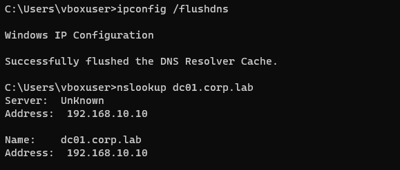

## Domain Join

`CLIENT01` was joined to the `corp.lab` domain using Domain Administrator credentials.

After the join operation, the workstation appeared as a computer object in Active Directory.

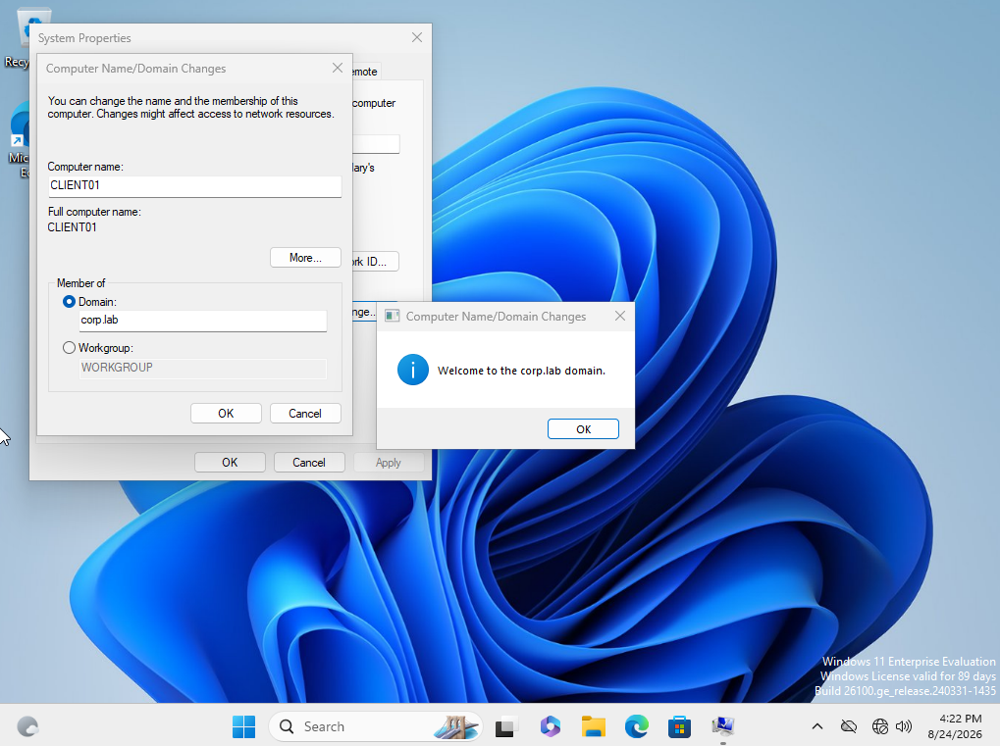

## Organizational Units

A custom Organizational Unit structure was created to separate users, workstations, and security groups:

```text
CORP
├── Users
├── Workstations
└── Groups
```

`CLIENT01` was moved from the default `Computers` container into the `CORP/Workstations` OU.

This structure allows Group Policies and administrative controls to be targeted at specific categories of Active Directory objects.

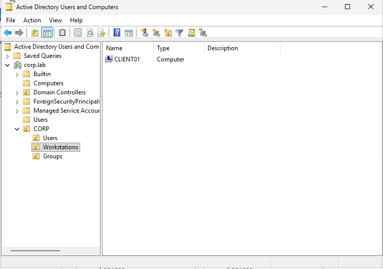

## Domain Users

A standard domain user named `john.doe` was created inside the `CORP/Users` OU.

The account was configured to require a password change at first logon. This was successfully enforced when the user first authenticated on `CLIENT01`.

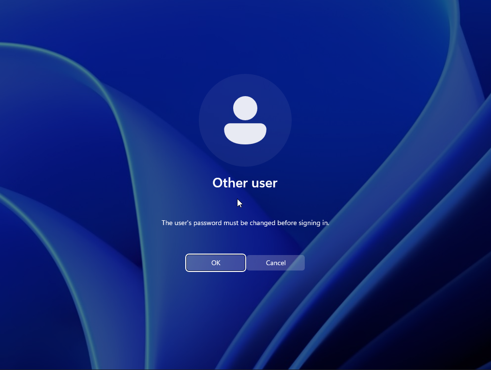

After authentication, the active identity was verified using:

```cmd
whoami
```

which returned:

```text
corp\john.doe
```

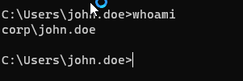

## Group Policy

A Group Policy Object named `GPO - Restrict Control Panel` was created and linked to the `CORP/Users` OU.

The following policy was enabled:

```text
User Configuration
└── Policies
    └── Administrative Templates
        └── Control Panel
            └── Prohibit access to Control Panel and PC settings
```

After running:

```cmd
gpupdate /force
```

on `CLIENT01`, access to Control Panel was successfully blocked for the affected user.

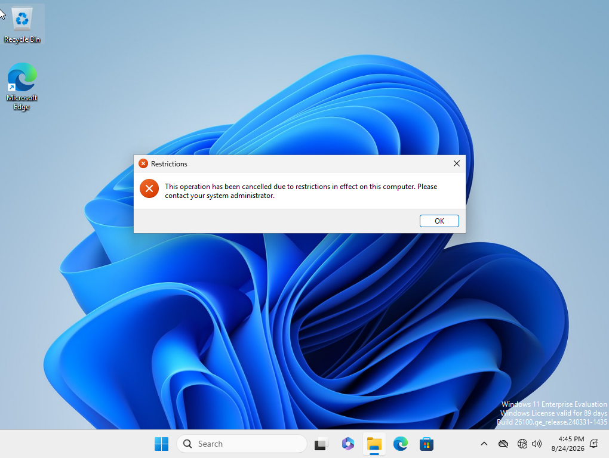

## Security Group Filtering

A Global Security Group named `GG-Restricted-Users` was created inside the `CORP/Groups` OU.

`john.doe` was added as a member of this group.

The Control Panel GPO was then configured with Security Filtering so that it would apply only to members of `GG-Restricted-Users`, rather than every user inside the `Users` OU.

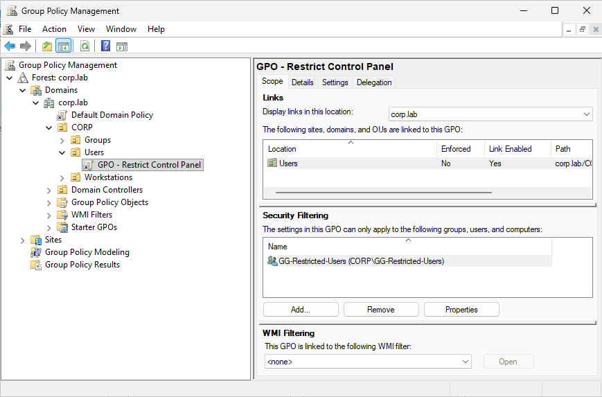

Group membership was verified on `CLIENT01` using:

```cmd
whoami /groups
```

After successful configuration, `GG-Restricted-Users` appeared in the user's security token.

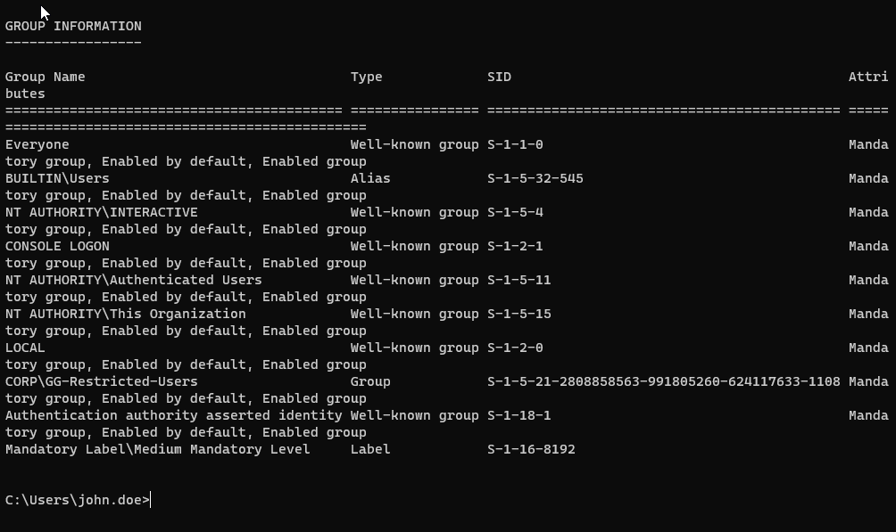

The applied Group Policies were verified using:

```cmd
gpresult /r
```

which confirmed:

```text
Applied Group Policy Objects
----------------------------
GPO - Restrict Control Panel
```

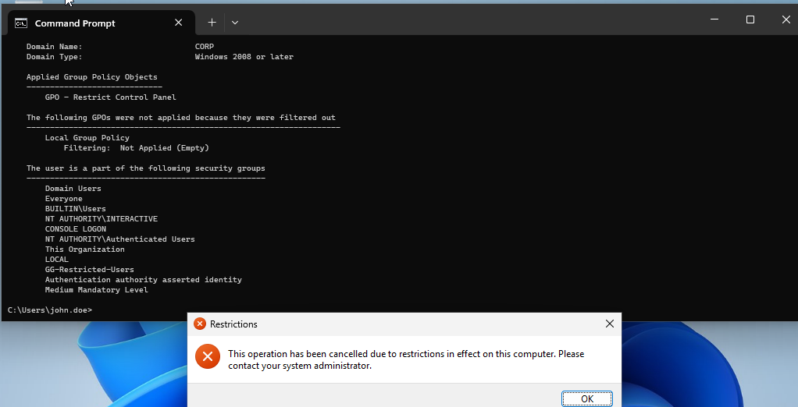

## Security Filtering Validation

A second domain user, `jane.doe`, was created inside the same `CORP/Users` OU but was **not** added to `GG-Restricted-Users`.

The results demonstrated that the GPO was being filtered based on security group membership:

| User | Restricted Group Member | Control Panel |
|---|---|---|
| `john.doe` | Yes | Blocked |
| `jane.doe` | No | Accessible |

`jane.doe` was able to access Control Panel normally despite residing in the same OU as `john.doe`.

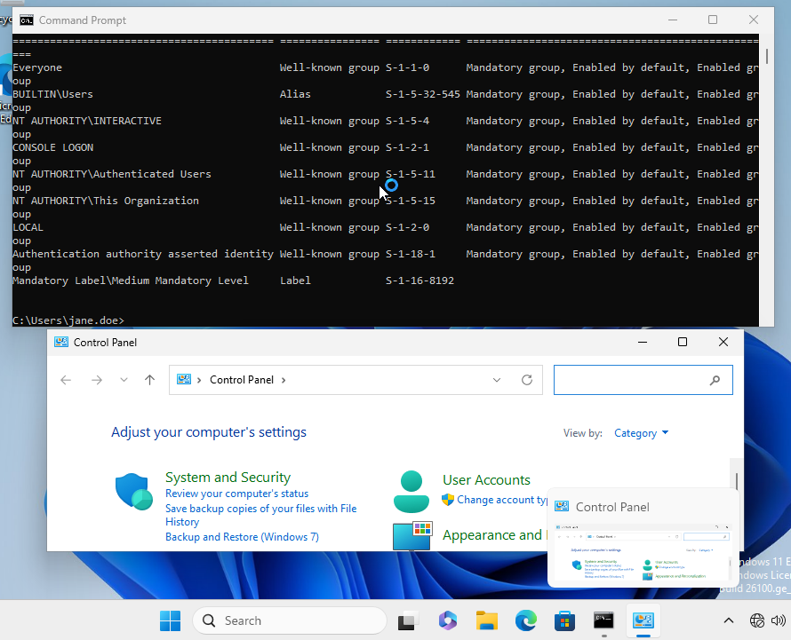

## Troubleshooting

### DHCP Authorization After Domain Promotion

After `DC01` was promoted to a Domain Controller, `CLIENT01` stopped receiving DHCP leases and assigned itself an APIPA address in the `169.254.0.0/16` range.

The DHCP service itself was running, but the DHCP server was not authorized in Active Directory.

The server was authorized using Domain Administrator credentials, after which `CLIENT01` successfully obtained its DHCP lease again.

### Incorrect DNS Registration

Because `DC01` has both a NAT interface and an internal LAB interface, DNS initially registered both:

```text
10.0.2.15
192.168.10.10
```

The NAT interface was configured not to register its address in DNS, and the incorrect `10.0.2.15` records were removed.

After refreshing DNS registration, `dc01.corp.lab` correctly resolved only to:

```text
192.168.10.10
```

### Security Group Membership

Although `john.doe` initially appeared in the security group's graphical interface, PowerShell verification showed that the membership had not been committed.

The issue was identified using:

```powershell
Get-ADGroupMember "GG-Restricted-Users"
```

The user was explicitly added using:

```powershell
Add-ADGroupMember -Identity "GG-Restricted-Users" -Members "john.doe"
```

Membership was then successfully verified.

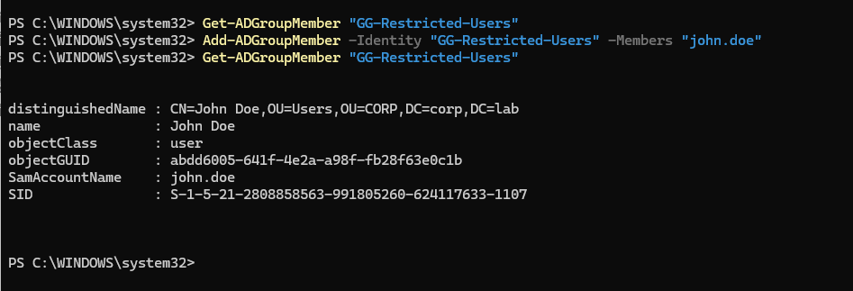

### GPO Security Filtering

After replacing `Authenticated Users` with `GG-Restricted-Users` in Security Filtering, the GPO stopped applying.

The issue was diagnosed using:

```cmd
gpresult /r
```

which showed:

```text
GPO - Restrict Control Panel
    Filtering: Not Applied (Unknown Reason)
```

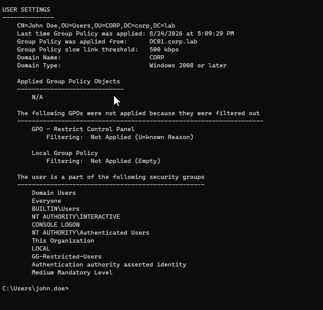

The permissions of `GG-Restricted-Users` were verified and confirmed to include both:

- `Read`
- `Apply Group Policy`

`Authenticated Users` was then granted **Read-only** access to the GPO, while `GG-Restricted-Users` retained both **Read** and **Apply Group Policy** permissions.

After refreshing Group Policy:

```cmd
gpupdate /force
gpresult /r
```

the GPO appeared under:

```text
Applied Group Policy Objects
----------------------------
GPO - Restrict Control Panel
```

The restriction was tested again on `john.doe`, and Control Panel access was successfully blocked.

This preserved the intended security filtering while allowing the GPO to be read correctly during policy processing.

## Result

The lab now provides centralized identity and workstation management through Active Directory.

The final configuration demonstrates:

- Active Directory Domain Services deployment
- DNS-based domain and service discovery
- Domain-joined Windows workstations
- Organizational Unit design
- Centralized domain user authentication
- Security group management
- Group Policy deployment
- Security Filtering
- Positive and negative policy validation
- Troubleshooting using PowerShell and native Windows diagnostic tools